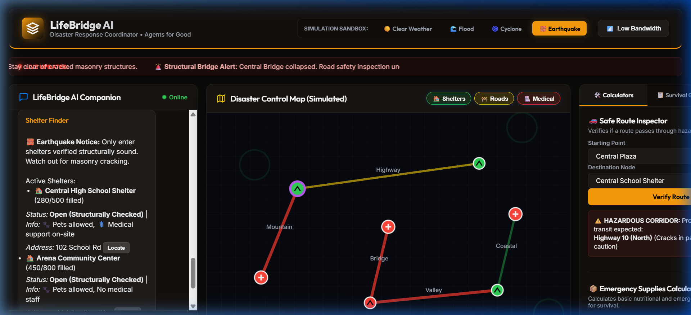
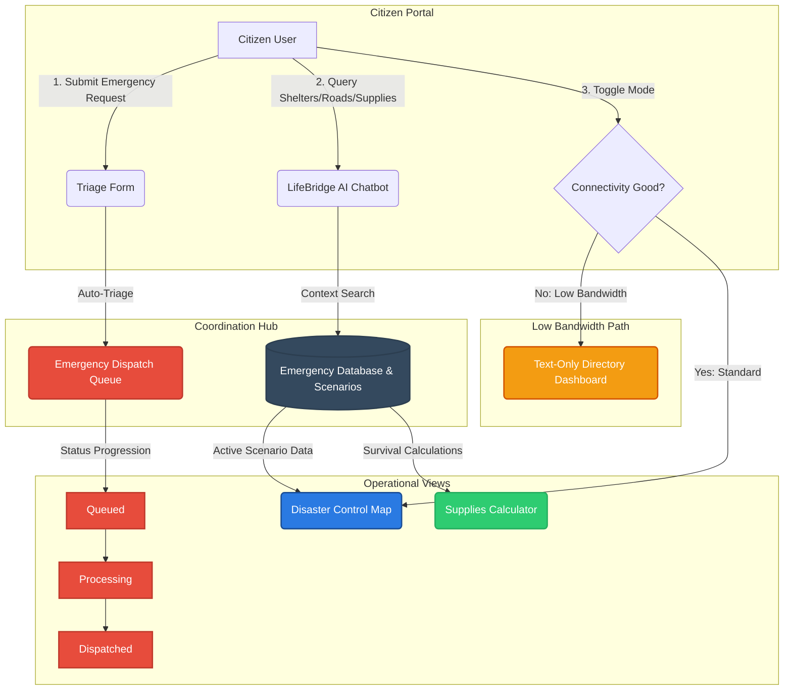

# 🌐 LifeBridge AI — Emergency Response & Disaster Assistant

LifeBridge AI is an AI-driven, interactive crisis management and disaster response dashboard designed for real-time triage, communication, and resource coordination. It is built to operate under severe constraints, featuring a dedicated **Low Bandwidth / Emergency Mode** to ensure citizens in disaster-affected areas can access life-saving information even on weak cellular networks.



---

## 📖 Table of Contents
- [Core Features](#-core-features)
- [Workflow & Architecture](#%EF%B8%8F-workflow--architecture)
- [Tech Stack](#%EF%B8%8F-tech-stack)
- [Getting Started](#-getting-started)
- [Usage Guide](#-usage-guide)

---

## ⚡ Core Features

1. **LifeBridge AI Companion**
   - A contextual chatbot that answers immediate questions regarding open shelters, route safety, and hospital availability based on active weather/disaster conditions.
   - Highlights actionable directions and links chatbot references directly with map focuses.

2. **Disaster Control Map (Simulated)**
   - Interactive SVG-based map displaying real-time safety status of major roads, shelters, and medical facilities.
   - Features active layers for Shelters, Road status (Safe, Hazard, Blocked), and Hospital capacity.

3. **Emergency Triage Queue**
   - A prioritized dispatch dashboard that processes user-submitted emergency reports.
   - Automatically triages reports by severity (`Danger`, `Warning`, `Info`) and advances dispatch stages (`Queued` ➡️ `Processing` ➡️ `Dispatched`).

4. **Low Bandwidth Mode**
   - Instantly strips away custom fonts, SVG map components, and heavy scripts, serving a text-only emergency directory of critical hotlines, shelters, and roads. Perfect for low signal areas.

5. **Resource & Supply Planner**
   - Calculator to estimate survival rations (water, food, first-aid kits) based on family size and targeted isolation duration.
   - Interactive emergency checklists (Pre-evacuation, Sheltering in Place).

6. **Interactive Simulation Sandbox**
   - Allows administrators to simulate scenarios like **Floods**, **Cyclones**, and **Earthquakes** to see dynamic changes in route blockages, shelter statuses, and medical facility loads.

---

## ⚙️ Workflow & Architecture

The workflow below illustrates how LifeBridge AI coordinates incoming citizen reports, AI assistance, dispatch queue operations, and map visualizer updates:



---

## 🛠️ Tech Stack

- **Frontend**: Vanilla HTML5, CSS3 (Modern dark-mode design with smooth gradients, cards, and transitions), and JavaScript (ES6+).
- **Backend / Server**: Node.js static HTTP server with custom MIME-type resolution for fast local deployments.
- **Icons & Visuals**: Inline SVG, CSS micro-animations, and Outfit/Inter typography.

---

## 🚀 Getting Started

### Prerequisites
Make sure you have **Node.js** installed on your system.

### Steps to Run Locally

1. **Clone the Repository**
   ```bash
   git clone <your-repository-url>
   cd lifebridge-ai
   ```

2. **Run the Server**
   Use the custom server script to host the dashboard locally:
   ```bash
   npm run dev
   ```
   Or run the server file directly:
   ```bash
   node server.js
   ```

3. **Open the Application**
   Open your browser and navigate to:
   ```
   http://localhost:3000
   ```

---

## 📖 Usage Guide

- **Change Scenarios**: Use the **Simulation Sandbox** at the top right to switch between *Clear Weather*, *Flood*, *Cyclone*, and *Earthquake*. Watch how the map roadblocks and shelter occupancies update instantly.
- **Ask the AI**: Type messages like `"Where is the nearest shelter?"` or `"Is Highway 10 safe?"` into the Chatbot input for immediate advice.
- **Triage an Issue**: Fill out the **Emergency Request Form** to see your ticket get queued. The dispatcher simulator will process and dispatch relief automatically over time.
- **Low Bandwidth**: Click the **Low Bandwidth** button to experience the rapid-loading, text-only operational directory layout.
